

# Keenetic Router Integration for Home Assistant

[Russian ver.](README_RU.md)

Home Assistant custom integration for Keenetic routers. It talks to the local Keenetic REST API and exposes router status, clients, interfaces, Wi-Fi, mesh nodes, USB/media state, firmware updates, and basic controls.

## Features

- Router diagnostics: CPU load, memory usage, uptime, hostname, domain name, WAN IP.
- Interface monitoring: WAN/VPN connectivity, traffic statistics, Ethernet ports, Wi-Fi interfaces.
- Wi-Fi control: enable/disable Wi-Fi interfaces and configure client idle timeout.
- Client management: device trackers and client policy selectors for selected or all known clients.
- Port forwarding controls: optional switches for configured forwarding rules.
- Mesh monitoring: mesh node status and diagnostic attributes.
- USB/media monitoring: USB power switches and media connectivity sensors when supported by the router.
- Firmware update entity with optional backup before install.
- Services for direct Keenetic API calls and router backup.

## Installation

### HACS

1. Open HACS.
2. Go to "Integrations".
3. Search for "Keenetic Router".
4. Install the integration.
5. Restart Home Assistant.

### Manual Installation

1. Download the latest release archive.
2. Copy the `ha_keenetic` folder to `custom_components`.
3. Restart Home Assistant.

## Keenetic Access

The integration connects to the router web API over HTTP or HTTPS using the host, port, username, and password configured in Home Assistant. Use a local router address whenever possible and avoid exposing the router interface outside your trusted network.

Security note: Wi-Fi QR code entities include the Wi-Fi password by design. Do not use the same password for Wi-Fi networks and the Keenetic administrator account.

For automatic discovery, enable UPnP in the Keenetic web interface:

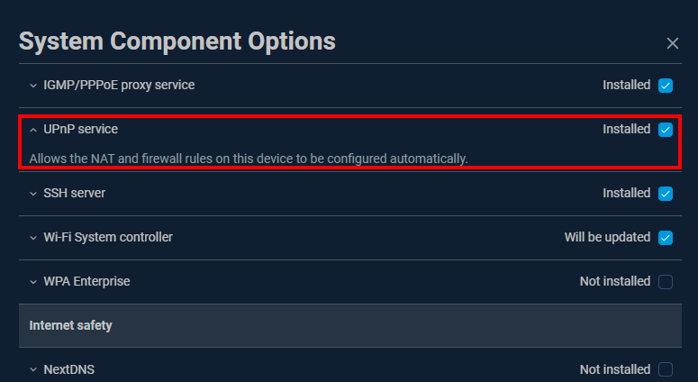

## Setup

If UPnP is enabled, Home Assistant can discover the router automatically.

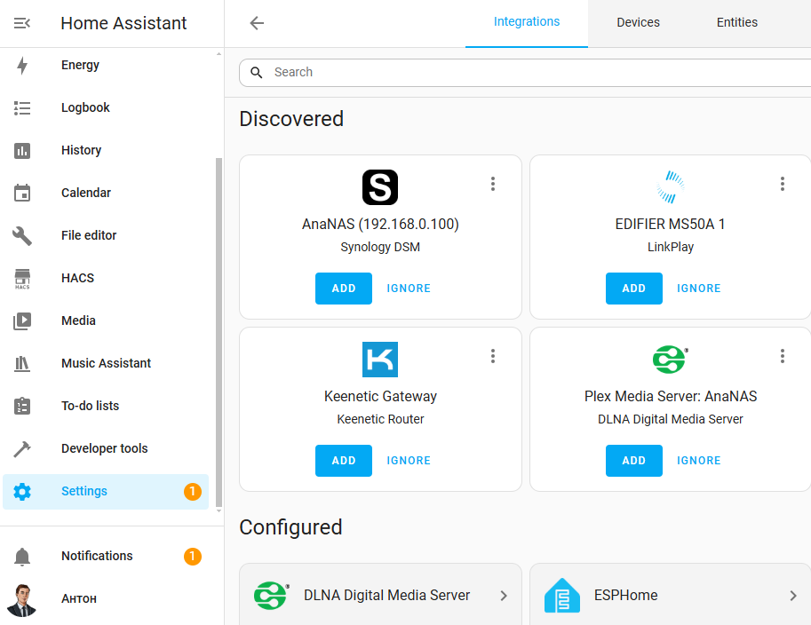

For manual setup:

1. Go to "Settings" > "Devices & services".
2. Click "+ ADD INTEGRATION".
3. Search for "Keenetic Router".
4. Enter router address, port, username, password, and SSL option.

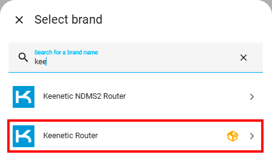

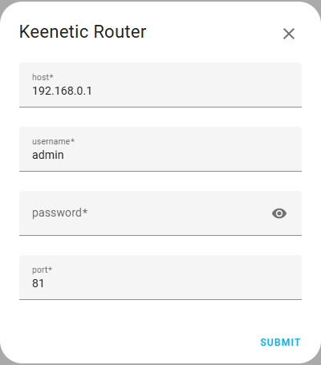

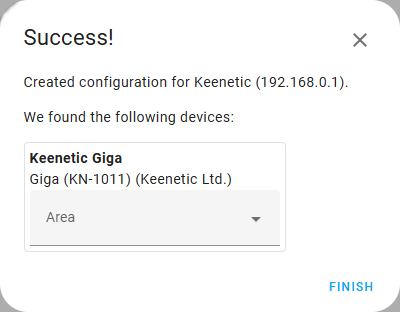

## Options

After setup, open integration options to configure:

- Polling interval.
- QR code image entities for selected Wi-Fi networks.
- Client policy selectors for selected clients or all clients.
- Device trackers for selected clients or all clients.
- Port forwarding switches.
- Backup file types for firmware update backup.

## Entities

### Sensors

- CPU load, memory usage, uptime.
- Hostname and domain name.
- WAN IP address.
- Wi-Fi client count.
- Mesh node status.
- Ethernet, Wi-Fi, USB, and VPN diagnostic sensors when available.

### Binary Sensors

- Router connection status.
- WAN/VPN interface connectivity.
- Ping Check status per monitored interface.
- USB/media connection status.

### Switches

- Wi-Fi interfaces.
- WAN/VPN and other controllable interfaces.
- Port forwarding rules.
- Web configurator public access.
- USB port power.

### Numbers

- Wi-Fi client idle timeout for supported Wi-Fi interfaces.

### Selects

- Internet access policy for selected clients.

### Device Trackers

- Optional trackers for selected or all known clients.

### Update

- Firmware update entity with optional configuration and firmware backup.

### Images

- Optional Wi-Fi QR code image entities.

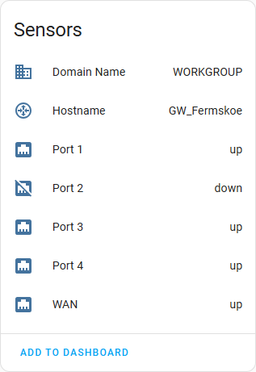

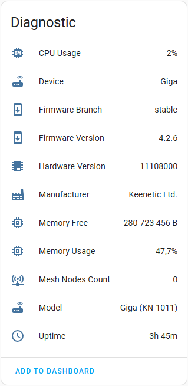

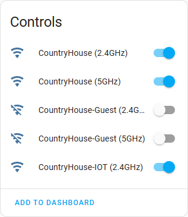

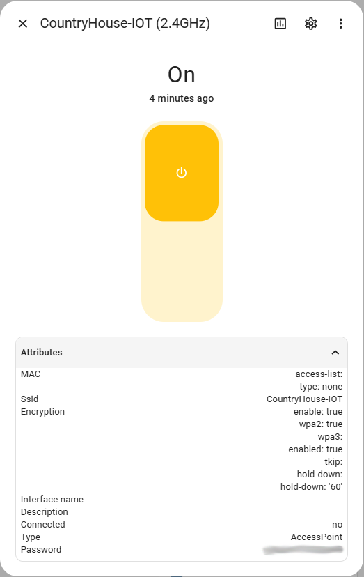

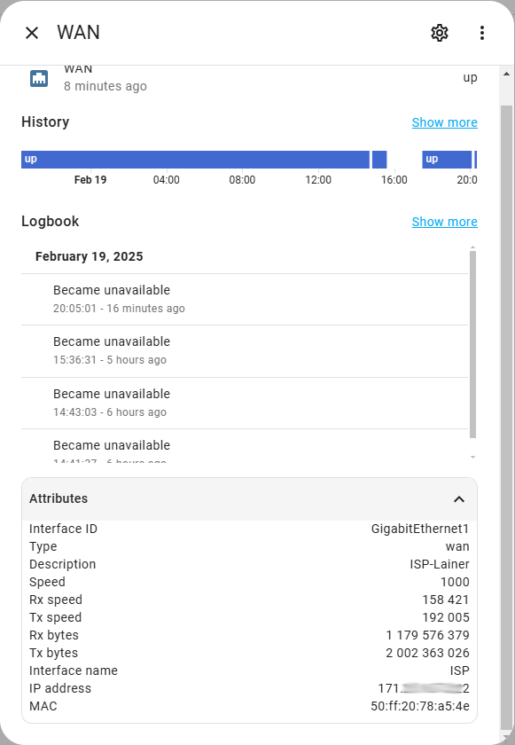

Mesh devices information, if available:

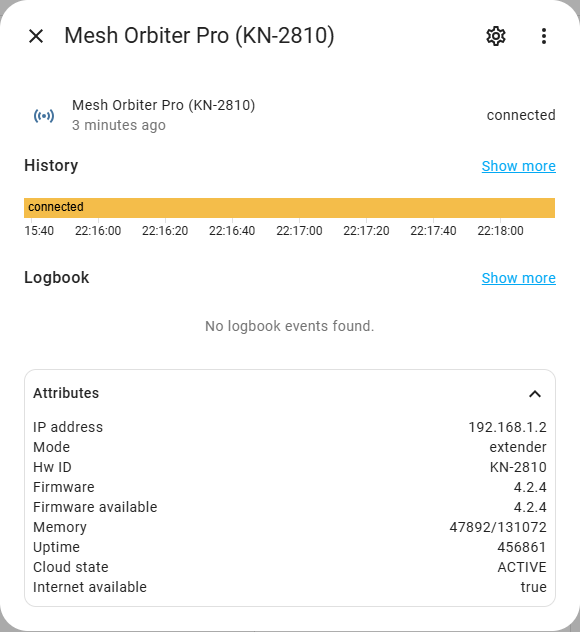

## Services

### `ha_keenetic.request_api`

Runs a direct request against the Keenetic API. Useful for diagnostics and advanced automations.

### `ha_keenetic.backup_router`

Downloads router configuration and/or firmware backup files.

## Supported Devices

Tested with:

- Keenetic Giga
- Keenetic Hero 4G
- Keenetic Sprinter SE

Other Keenetic models and modes should work if the required API endpoints are available.

## Contributing

Issues, logs, and pull requests are welcome.

## License

This project is licensed under the MIT License. See [LICENSE](LICENSE) for details.
